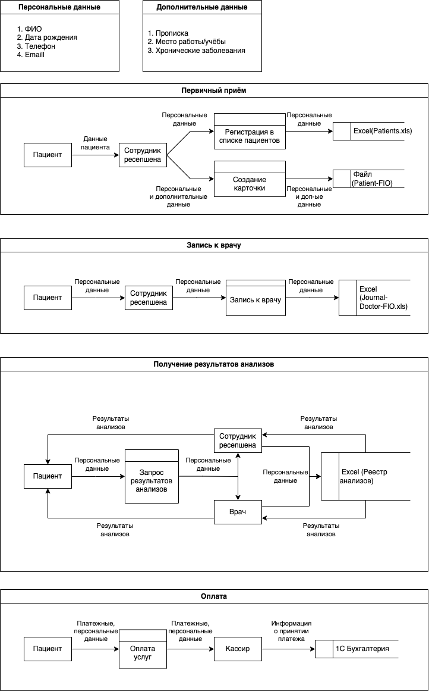

# Диаграммы потоков

# Аудит мер безопасности

## Проблемные зоны

1. **Заполнение данных**. Все данные вносятся и обрабатываются сотрудниками в ручном режиме в фалы. Высок риск сделать ошибку, сохранить что-то не туда или вообще потерять.

2. **Доступ к данным**. Все файлы хранятся на общем диске. Нет никакой защиты, нет ролей. Любой пользователь системы может просмотреть любые данные пациента.

3. **Классификация данных**. Данные никак не классифицируются. Нет понятий персональные, чувствительные данные.

4. **Отсутствие аудита действий**. Потоки данных никак не контролируются.

5. **Доменна аутентификация**. Кроме доменной аутентификации, со стороны систем обработки нет ограничений на доступ к данным.

## Улучшения

1. Использования механизмов аутентификацияя и авторизации. Усилилит доменную аутентификацию.

2. Внедрение RBAC. Каждый сотрудник должен получить собственную роль в системе, а с ней и реализацию принципа наименьший привелегий. Позволит утранить утечку, риск ошибок и общий доступ к данным.

3. Использоать теггирование данных. Позволит использовать различные полтики к обработке каждого типа данных. Предлагаемые теги:
    - *PII* - персональные данные
    - *Medical* - медицинские данные, анализы
    - *Sensitive* - чувствительные данные (место работы, проживания)

4. Использовать шифрование всех данных прицента при хранении и передаче.

5. Защита данных. Использовать дополнительные способы защиты в зависимости от тега:
    - *PII* - RBAC
    - *Medical* - маскирование
    - *Sensitive* - маскирование